# Relatório — Segurança de Rede: Perímetro, L2, L3, L4 e L7 no Kathará

Trabalho em grupo. Segurança de perímetro, L2 e L3: colega de grupo (Seções 2 e 3). L4, L7 e Filtragem de DNS: Paulo Henrique (Seções 4 a 7).

---

## 1. Objetivo

Este laboratório implementa e analisa mecanismos de segurança de rede em diferentes camadas, utilizando o Kathará. Ao longo do trabalho foram abordados:

- Segurança de perímetro, com firewall e filtragem de tráfego;
- Princípio de Default Deny e filtragem stateful;
- Controle de tráfego na camada de enlace (L2), por endereço MAC;
- Controle de tráfego na camada de rede (L3), por protocolo ICMP e por endereço IP de destino;
- Bloqueio por porta na camada de transporte (L4);
- Deep Packet Inspection (DPI) por assinatura na camada de aplicação (L7), incluindo identificação de aplicação independente da porta e controle de recurso específico dentro de uma aplicação Web;
- Filtragem de DNS por domínio específico e por categoria de sites;
- Defesa em profundidade (defense in depth), combinando todas as camadas anteriores.

A topologia utilizada, dada pelo professor, possui uma LAN (`pc1`, `pc2`), uma DMZ (`web`, `dns`), uma rede de gerenciamento (`adm`) e uma rede de borda conectada ao roteador `r0`. O `fw` roteia entre todas elas: `eth0` na LAN, `eth1` na DMZ, `eth2` na rede de gerenciamento e `eth3` na borda.

---

## 2. Segurança de Perímetro

### 2.1 Configuração inicial do firewall

O dispositivo `fw` foi utilizado como firewall de perímetro entre as diferentes redes da topologia. As interfaces do firewall são:

| Interface | Rede | Endereço |
|---|---|---|
| eth0 | LAN | 10.0.1.1/24 |
| eth1 | DMZ | 10.0.2.1/24 |
| eth2 | Gerenciamento | 10.0.3.1/24 |
| eth3 | Borda | 198.51.100.1/30 |

Antes da aplicação das regras restritivas, foi realizada a verificação das interfaces e das rotas do firewall.

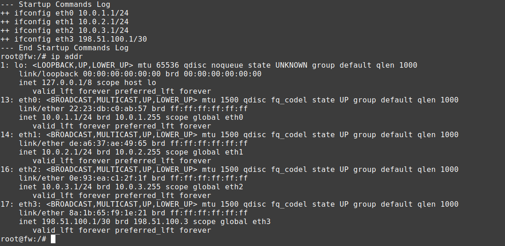
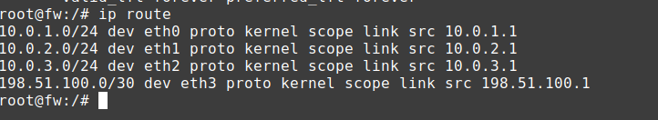

### 2.2 Ativação do encaminhamento de pacotes

Como o dispositivo `fw` possui a função de firewall e roteador entre diferentes redes, foi habilitado o encaminhamento IPv4:

```bash
sysctl -w net.ipv4.ip_forward=1
```

A configuração foi conferida com:

```bash
sysctl net.ipv4.ip_forward
```

O resultado esperado é `net.ipv4.ip_forward = 1`.

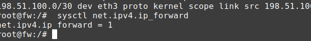

### 2.3 Política Default Deny

Foi adotado o princípio de Default Deny, segundo o qual o firewall bloqueia, por padrão, o tráfego que passa por ele e somente permite explicitamente as comunicações necessárias.

A política padrão da cadeia `FORWARD` foi configurada com:

```bash
iptables -P FORWARD DROP
```

A configuração pode ser verificada com:

```bash
iptables -L FORWARD -n -v
```

Dessa forma, qualquer tráfego encaminhado pelo firewall que não possua uma regra específica de permissão será bloqueado.

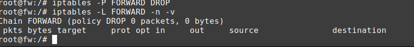

### 2.4 Filtragem stateful

Para permitir as respostas de conexões que já foram autorizadas, foi utilizada filtragem stateful:

```bash
iptables -A FORWARD -m conntrack --ctstate ESTABLISHED,RELATED -j ACCEPT
```

Essa regra permite que o firewall reconheça pacotes pertencentes a conexões já estabelecidas ou relacionadas a elas. Por exemplo, quando um computador da LAN inicia uma conexão com um servidor Web, o firewall permite a conexão inicial e posteriormente permite os pacotes de resposta pertencentes àquela conexão.

### 2.5 Política de comunicação

A política implementada foi:

| Comunicação | Política |
|---|---|
| LAN → Internet | Permitir |
| LAN → Web/DNS da DMZ | Permitir |
| Internet → Web | Permitir |
| Internet → LAN | Bloquear |
| DMZ → LAN | Bloquear |
| Respostas de conexões permitidas | Permitir |

### 2.6 LAN → Internet

Para permitir que os dispositivos da LAN iniciem conexões em direção à rede de borda, foi criada uma regra permitindo o encaminhamento da interface da LAN (`eth0`) para a interface de borda (`eth3`):

```bash
iptables -A FORWARD -i eth0 -o eth3 -s 10.0.1.0/24 -m conntrack --ctstate NEW -j ACCEPT
```

Com isso, novas conexões originadas na LAN podem ser encaminhadas em direção à Internet. Teste realizado no `pc1`:

```bash
ping -c 4 8.8.8.8
```

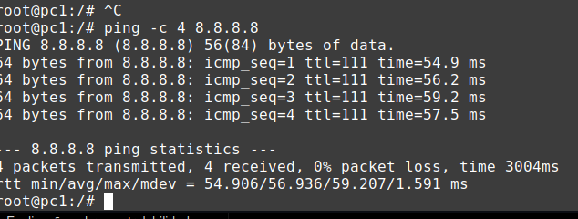
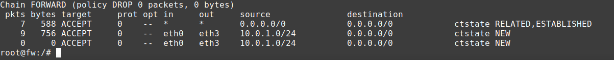

### 2.7 LAN → DMZ

A comunicação da LAN com os servidores da DMZ foi autorizada:

```bash
iptables -A FORWARD -i eth0 -o eth1 -s 10.0.1.0/24 -d 10.0.2.0/24 -m conntrack --ctstate NEW -j ACCEPT
```

Essa regra permite que os computadores da LAN estabeleçam novas conexões com os servidores da DMZ. O acesso ao servidor Web foi testado com:

```bash
curl http://10.0.2.10
```

Também pode ser utilizado:

```bash
ping -c 4 10.0.2.10
```

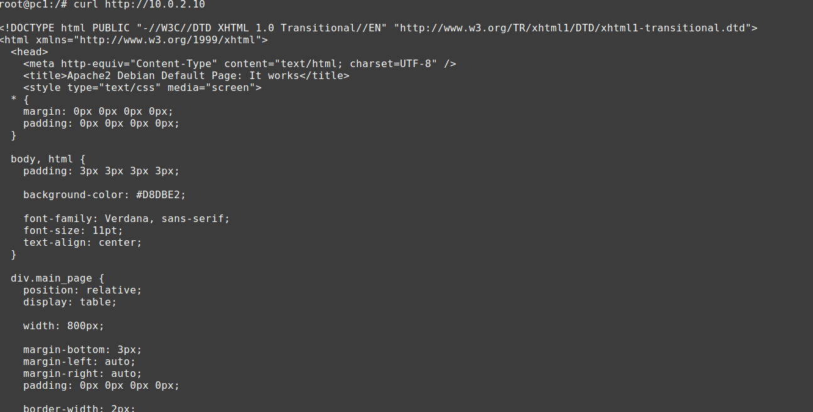

### 2.8 Internet → Web

Para permitir que conexões externas alcancem o servidor Web da DMZ, foi criada uma regra permitindo novas conexões TCP destinadas à porta 80 do servidor Web:

```bash
iptables -A FORWARD -i eth3 -o eth1 -d 10.0.2.10 -p tcp --dport 80 -m conntrack --ctstate NEW -j ACCEPT
```

Essa regra permite somente o tráfego HTTP destinado ao servidor Web.

Observação: para esse teste representar realmente uma conexão originada da Internet, o `r0` precisa possuir o encaminhamento/NAT correspondente para direcionar o tráfego externo ao `10.0.2.10`. A regra acima representa o controle realizado pelo `fw`.

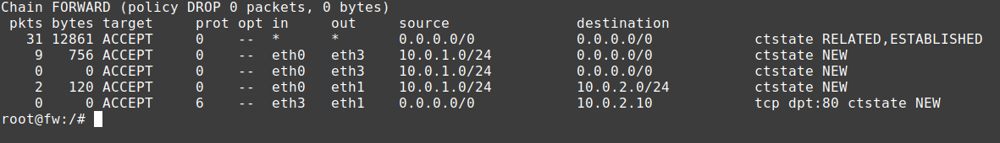

O teste de acesso externo ao servidor Web não foi executado porque a infraestrutura de DNAT/encaminhamento externo não estava configurada no `r0`. A regra de filtragem Internet → Web foi implementada no `fw`.

### 2.9 Internet → LAN

Não foi criada nenhuma regra permitindo novas conexões da interface de borda (`eth3`) para a LAN (`eth0`). Como a política padrão da cadeia `FORWARD` é `DROP`, uma tentativa de iniciar uma conexão da Internet para a LAN será bloqueada. Essa configuração segue o princípio de menor privilégio, pois a comunicação externa com as estações internas não é necessária.


### 2.10 DMZ → LAN

Também não foi criada uma regra permitindo novas conexões da DMZ para a LAN. Assim, um servidor da DMZ não pode iniciar livremente conexões contra os computadores da LAN. A ausência de uma regra de permissão, combinada com a política padrão `DROP`, resulta no bloqueio: `DMZ → LAN = BLOQUEADO`.

As respostas de conexões previamente autorizadas continuam sendo permitidas pela regra `-m conntrack --ctstate ESTABLISHED,RELATED`.

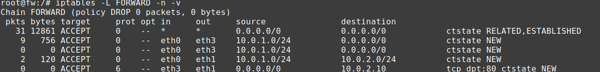

### 2.11 Resultado da segurança de perímetro

A configuração final utiliza o princípio de Default Deny. O firewall bloqueia por padrão as conexões encaminhadas e permite explicitamente somente os fluxos necessários. A filtragem stateful também permite diferenciar novas conexões de respostas pertencentes a conexões já estabelecidas. Dessa forma, a arquitetura implementa uma política de menor privilégio:

```
LAN → Internet        PERMITIDO
LAN → DMZ              PERMITIDO
Internet → Web         PERMITIDO
Internet → LAN         BLOQUEADO
DMZ → LAN              BLOQUEADO
Respostas               PERMITIDAS
```

---

## 3. Controles em Diferentes Camadas

Os experimentos seguintes foram realizados seguindo o ciclo:

```
Gerar tráfego
   ↓
Observar
   ↓
Aplicar regra
   ↓
Testar novamente
   ↓
Explicar resultado
```

Foi utilizado o `tcpdump` para observar o tráfego em diferentes momentos.

### 3.1 L2 — Bloqueio por endereço MAC

**Objetivo:** neste experimento, o `pc2` foi considerado um dispositivo comprometido. O objetivo foi bloquear seu tráfego utilizando o endereço MAC, demonstrando um controle baseado na camada de enlace.

#### 3.1.1 Identificação do MAC do pc2

No `pc2` foi executado:

```bash
ip link show eth0
```

O comando apresenta o endereço MAC da interface de rede.

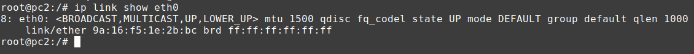

#### 3.1.2 Teste antes do bloqueio

Antes de aplicar a regra, foi verificado que o `pc2` conseguia alcançar o servidor Web:

```bash
ping -c 4 10.0.2.10
```

O mesmo teste foi realizado no `pc1`, e ambos os computadores apresentaram conectividade.

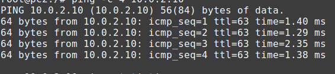
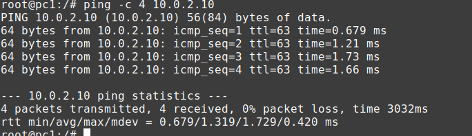

#### 3.1.3 Aplicação do bloqueio por MAC

No firewall foi aplicada uma regra utilizando o endereço MAC identificado anteriormente:

```bash
iptables -I FORWARD -i eth0 -m mac --mac-source MAC_DO_PC2 -j DROP
```

O valor `MAC_DO_PC2` deve ser substituído pelo endereço real encontrado no `pc2`. Por exemplo:

```bash
iptables -I FORWARD -i eth0 -m mac --mac-source 02:42:0a:00:01:0b -j DROP
```

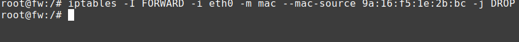

#### 3.1.4 Teste após o bloqueio

Novamente foi realizado `ping -c 4 10.0.2.10` no `pc2`. O tráfego passou a ser bloqueado. Em seguida, o mesmo teste foi realizado no `pc1`, que continuou funcionando normalmente.

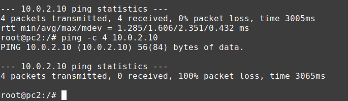
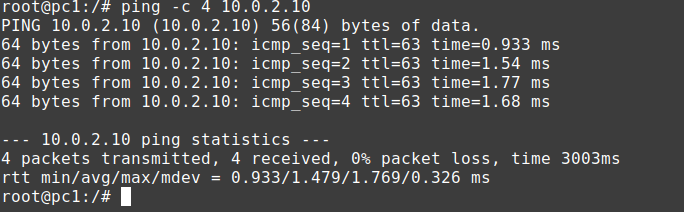

#### 3.1.5 Análise do experimento L2

O experimento demonstrou que o firewall pode utilizar o endereço MAC como critério de filtragem quando o tráfego chega por um enlace Ethernet no qual o endereço MAC de origem está disponível.

O endereço MAC, entretanto, não acompanha o pacote durante todo o percurso pela Internet. Ele é utilizado na comunicação dentro de um enlace local. Quando o pacote passa por um roteador, o quadro de enlace é reconstruído para o próximo enlace, utilizando os endereços MAC correspondentes àquele segmento.

Portanto, o firewall consegue identificar o MAC original do `pc2` porque o `pc2` está diretamente conectado à mesma rede de enlace do firewall:

```
pc2
 ↓
LAN
 ↓
fw
```

Já um firewall localizado em outro segmento da Internet não conseguiria utilizar o MAC original do `pc2` como identificador do tráfego recebido.

### 3.2 L3 — Bloqueio de ICMP

**Objetivo:** neste experimento foi realizado um bloqueio baseado no protocolo ICMP, utilizando informações da camada de rede. O `ping` foi utilizado para gerar tráfego ICMP e o `tcpdump` foi utilizado para observar os pacotes.

#### 3.2.1 Teste antes da regra

No `pc1`:

```bash
ping -c 4 10.0.2.10
```

O servidor Web da DMZ respondeu normalmente.

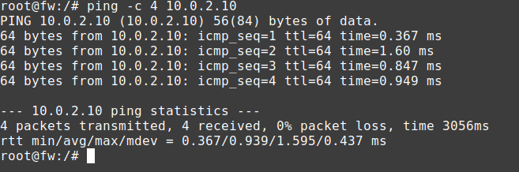

#### 3.2.2 Observação com tcpdump

No `fw`, na interface da LAN:

```bash
tcpdump -i eth0 icmp
```

Enquanto o `tcpdump` estava executando, foi realizado o ping no `pc1`. Os pacotes ICMP puderam ser observados chegando ao firewall.

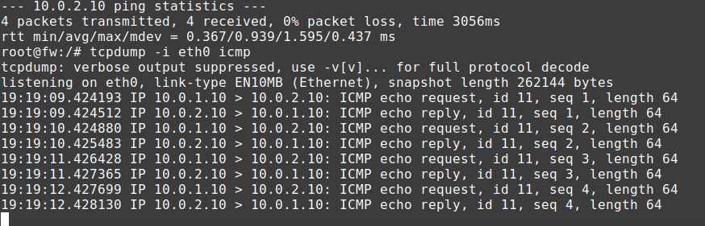

#### 3.2.3 Aplicação da regra

Foi criada uma regra para bloquear ICMP entre a LAN e a DMZ:

```bash
iptables -I FORWARD -i eth0 -o eth1 -s 10.0.1.0/24 -d 10.0.2.0/24 -p icmp -j DROP
```

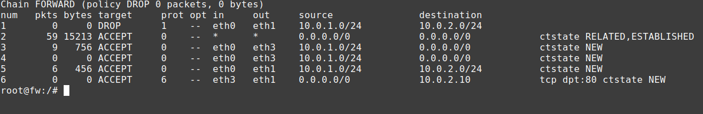

#### 3.2.4 Teste após o bloqueio

Novamente no `pc1`, `ping -c 4 10.0.2.10` deixou de receber respostas.

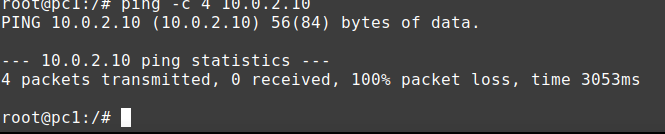

O `tcpdump` pode ser utilizado novamente para observar que os pacotes ICMP chegam ao firewall, mas não são encaminhados para a DMZ.

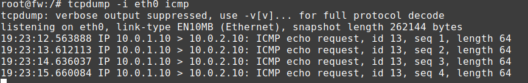

#### 3.2.5 Análise do experimento ICMP

O experimento demonstrou que é possível aplicar políticas específicas para determinados protocolos. O bloqueio do ICMP não significa necessariamente que toda comunicação entre a LAN e a DMZ foi bloqueada. A regra atua especificamente sobre:

```
protocolo = ICMP
origem = LAN
destino = DMZ
```

Assim, diferentes protocolos podem receber diferentes políticas de segurança.

### 3.3 L3 — Bloqueio por endereço IP de destino

**Objetivo:** neste experimento foi simulado o bloqueio de um destino IP que a organização decidiu proibir. Foi utilizado um endereço de laboratório como destino do teste, evitando depender de um site real ou de conteúdo malicioso.

#### 3.3.1 Definição do destino

Para o experimento, foi escolhido `DESTINO = 10.0.2.10`. O endereço representa, neste laboratório, um destino que será temporariamente considerado proibido.

#### 3.3.2 Teste antes da regra

No `pc1`, `ping -c 4 10.0.2.10` mostrou que o destino estava acessível.

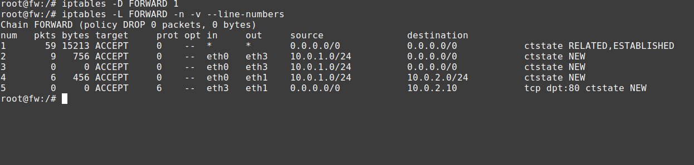

#### 3.3.3 Aplicação do bloqueio

No firewall:

```bash
iptables -I FORWARD -i eth0 -d 10.0.2.10 -j DROP
```

A regra bloqueia o tráfego originado na LAN destinado especificamente ao endereço IP `10.0.2.10`.

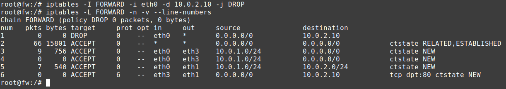

#### 3.3.4 Teste após a regra

No `pc1`, `ping -c 4 10.0.2.10` teve o acesso bloqueado.

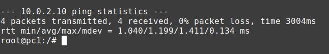

#### 3.3.5 Análise do bloqueio por IP

O bloqueio por endereço IP é um mecanismo útil em determinadas situações, porém não identifica necessariamente um site ou serviço de forma completa. Um domínio pode possuir vários endereços IP:

```
site.exemplo
     ↓
  ┌──┼──┐
 IP1 IP2 IP3
```

Nesse cenário, bloquear somente IP1 não necessariamente impede o acesso ao domínio, pois o cliente pode receber IP2 ou IP3. Além disso, um mesmo endereço IP pode hospedar vários sites e serviços, algo comum em infraestruturas compartilhadas e em serviços de CDN. Outro fator é que os endereços associados a um domínio podem mudar ao longo do tempo.

Portanto, o bloqueio baseado exclusivamente em IP possui limitações quando o objetivo é bloquear um domínio ou uma aplicação específica.

---

## 4. Preparação do ambiente de teste (L4 e L7)

Como o laboratório não tem acesso real à internet nem um cliente BitTorrent de verdade instalado, foi usado um simulador de peer BitTorrent (`shared/bt_peer.py`). Ele monta o handshake real do protocolo, um pacote de 68 bytes formado por 1 byte de tamanho, a string "BitTorrent protocol", 8 bytes reservados, 20 bytes de info_hash e 20 bytes de peer_id, suficiente para provar se o firewall reconhece o protocolo pelo conteúdo.

Antes de cada bateria de testes, foram subidos no `web` (10.0.2.10) dois listeners do simulador (portas 6881 e 443) e um servidor HTTP simples com duas pastas, `/public` e `/admin`; e no `pc1` (10.0.1.10) um listener na porta 6881, simulando um host da LAN compartilhando arquivos.

```bash
python3 /shared/bt_peer.py server 6881 &
python3 /shared/bt_peer.py server 443 &
python3 -m http.server 80   # em /tmp/www, com /public e /admin
```

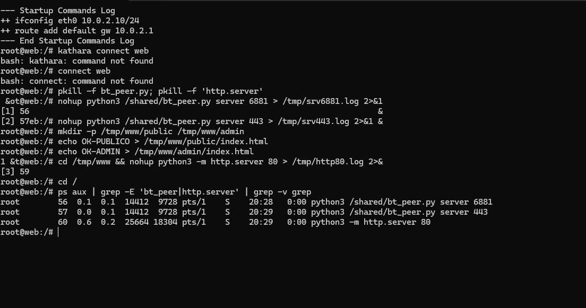
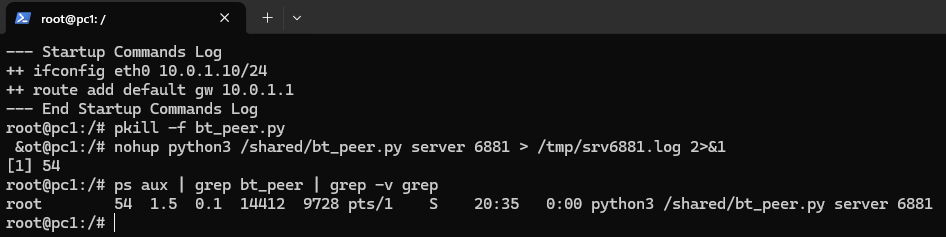

---

## 5. L4 — Bloqueio por porta (BitTorrent)

### 5.1 Objetivo

Bloquear o tráfego BitTorrent olhando apenas a porta de destino, sem inspecionar o conteúdo do pacote. As portas oficiais do protocolo são 6881–6999/tcp,udp (troca de dados entre peers) e 6969 (tracker).

### 5.2 Teste antes da regra (baseline)

No `pc1`, antes de qualquer regra no `fw`, foi realizado o handshake BitTorrent contra o `web`:

```bash
python3 /shared/bt_peer.py client 10.0.2.10 6881
```

O servidor recebeu os 68 bytes do handshake normalmente, confirmando que o cenário funciona antes de qualquer bloqueio.

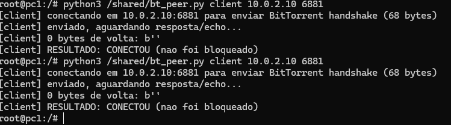
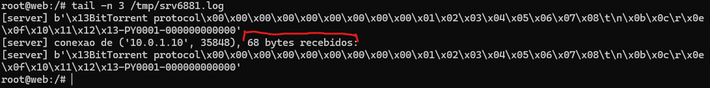

### 5.3 Aplicação da regra L4

No `fw` foi aplicado o script `fw/root/l4_p2p.sh`, que cria uma cadeia própria `P2P` com DROP incondicional e insere, no topo da cadeia `FORWARD`, regras casando por porta de destino em ambas as direções (cliente da LAN abrindo conexão para fora, e um host da LAN sendo acessado de fora como servidor):

```bash
iptables -N P2P
iptables -A P2P -j DROP
iptables -I FORWARD 1 -p tcp -m multiport --dports 6881:6999,6969 -i eth0 -j P2P
iptables -I FORWARD 1 -p udp -m multiport --dports 6881:6999,6969 -i eth0 -j P2P
iptables -I FORWARD 1 -p tcp -m multiport --dports 6881:6999,6969 -o eth0 -j P2P
iptables -I FORWARD 1 -p udp -m multiport --dports 6881:6999,6969 -o eth0 -j P2P
```

A verificação foi feita com `iptables -L FORWARD -v -n --line-numbers | head -10`.

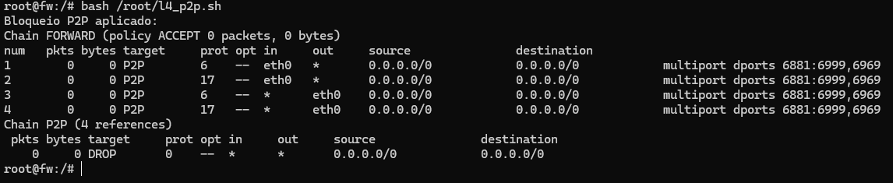

### 5.4 Teste após o bloqueio

Cliente da LAN (`pc1`) tentando o handshake contra o `web` na porta oficial:

```bash
python3 /shared/bt_peer.py client 10.0.2.10 6881
```

Resultado: TimeoutError no `connect()`. O handshake TCP nem chega a fechar, a conexão é derrubada antes de qualquer dado trafegar.

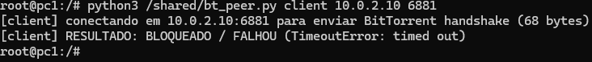

Host da LAN do lado servidor (`web` tentando abrir conexão contra `pc1:6881`, simulando alguém de fora acessando um peer da LAN):

```bash
python3 /shared/bt_peer.py client 10.0.1.10 6881   # executado a partir do web
```

Resultado: também bloqueado. Isso confirma que a regra `-o eth0` cobre a direção em que o host da LAN está do lado servidor, não só do lado cliente.

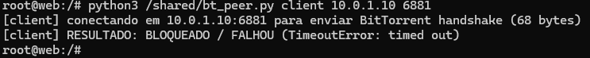

### 5.5 Evasão por troca de porta (limitação do L4)

O mesmo tráfego BitTorrent foi enviado do `pc1` para o `web`, mas usando a porta 443 (a mesma porta usada por HTTPS) em vez da porta oficial:

```bash
python3 /shared/bt_peer.py client 10.0.2.10 443
```

Resultado: o handshake completo (68 bytes) chegou ao servidor, ou seja, o tráfego passou. Como o L4 só examina o número da porta, qualquer aplicação que use uma porta fora da lista bloqueada acaba passando, mesmo carregando o mesmo protocolo.

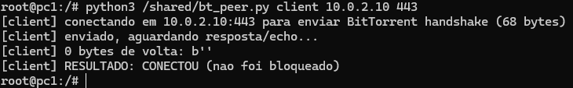
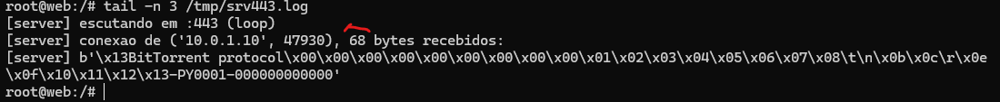

Perceba que o servidor da porta 443 realmente recebeu os 68 bytes.

### 5.6 Análise do experimento L4

O bloqueio por porta é barato e eficaz contra o uso das portas oficiais, inclusive interrompendo conexões já em andamento (a regra é inserida antes de qualquer ACCEPT existente). Porém, o experimento 5.5 evidencia sua principal limitação: como o critério é só a porta de destino, um cliente pode contornar o bloqueio simplesmente usando outra porta.

Outras limitações discutidas: clientes BitTorrent reais normalmente escolhem porta aleatória, não fixa, o que já reduziria a eficácia da lista de portas fora do laboratório; o controle não cobre o protocolo uTP (BitTorrent sobre UDP) nem consultas DHT fora da porta 6969; e não há qualquer inspeção de conteúdo. Esses dois fatores motivam a camada L7, a seguir.

---

## 6. L7 — Deep Packet Inspection (DPI) por assinatura

### 6.1 Tecnologias pesquisadas

Como o bloqueio por porta é evadido facilmente, a defesa em profundidade pede uma camada que examine o conteúdo, a aplicação ou o destino do tráfego, não só a porta. Foram pesquisadas 5 tecnologias de controle L7:

| Tecnologia | Como funciona | Melhor para |
|---|---|---|
| DNS Filtering (dnsmasq/BIND) | Servidor DNS recusa resolver, ou resolve para 0.0.0.0, nomes de uma lista | Bloquear domínio específico e categoria de sites |
| DPI por assinatura (iptables -m string, nDPI) | Casa uma sequência de bytes conhecida no payload do pacote | Identificar aplicação independente da porta; controlar recurso (path) dentro dela |
| IPS/NGFW inline (Suricata) | Motor de assinaturas + heurísticas, decide pacote a pacote | Evolução do DPI simples para um controle atualizável e escalável |
| Proxy de aplicação (Squid) | Sessão passa por proxy explícito/transparente, decide por SNI/domínio/categoria | Domínio e categoria, com mais log e controle por sessão que o DNS Filtering |
| WAF / Application Firewall (ModSecurity) | Regras de aplicação Web: path, método, payload malicioso | Permitir /public e bloquear /admin, e outros controles de recurso da aplicação |

Deste conjunto, foram implementadas e testadas duas: DPI por assinatura com `iptables -m string` (item 6.2 em diante) e DNS Filtering com `dnsmasq` (item 7). Juntas, elas cobrem as cinco capacidades pedidas no enunciado, sem exigir a instalação de nenhum serviço fora da imagem padrão do Kathará.

### 6.2 Aplicação da regra L7

No `fw` foi aplicado o script `fw/root/l7_dpi.sh`. Ele cria duas cadeias novas: `L7`, para tráfego P2P, com DROP; e `L7HTTP`, para HTTP bloqueado, com REJECT `--reject-with tcp-reset`, que avisa explicitamente o cliente da recusa. As regras casam pelo conteúdo do pacote usando o módulo `-m string --algo bm` (busca binária Boyer-Moore), em qualquer porta:

- Handshake BitTorrent: `--hex-string "|13|BitTorrent protocol"` em TCP, nas duas direções;
- Consulta DHT (BEP 5): `--string "d1:ad2:id20:"` em UDP, nas duas direções;
- Caminho HTTP `/admin`: `--string "GET /admin"`, de LAN para DMZ, porta 80.

```bash
iptables -N L7 && iptables -A L7 -j DROP
iptables -I FORWARD 1 -p tcp -m string --algo bm --hex-string "|13|BitTorrent protocol" -i eth0 -j L7
iptables -I FORWARD 1 -p udp -m string --algo bm --string "d1:ad2:id20:" -i eth0 -j L7
iptables -N L7HTTP && iptables -A L7HTTP -j REJECT --reject-with tcp-reset
iptables -I FORWARD 1 -p tcp --dport 80 -i eth0 -o eth1 -m string --algo bm --string "GET /admin" -j L7HTTP
```

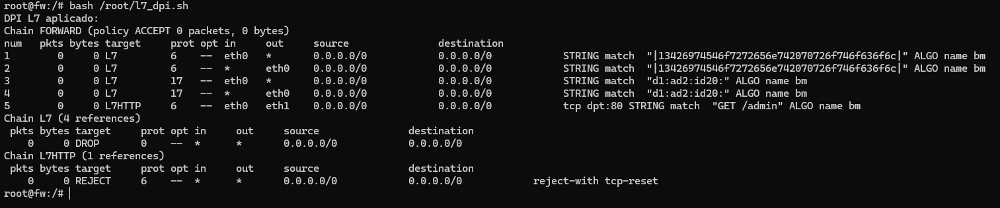

### 6.3 Teste: mesma porta 443, agora bloqueada pelo conteúdo

Repetindo exatamente o teste do item 5.5 (que havia passado), agora com o L7 ativo:

```bash
python3 /shared/bt_peer.py client 10.0.2.10 443
```

A conexão TCP chega a se estabelecer. O handshake de rede (SYN/SYN-ACK/ACK) não carrega dado, então o `iptables -m string` não tem o que examinar nesse momento, mas o servidor nunca recebe os 68 bytes do handshake BitTorrent. Por isso a confirmação do bloqueio foi feita conferindo o log do servidor, e não apenas a saída do cliente.

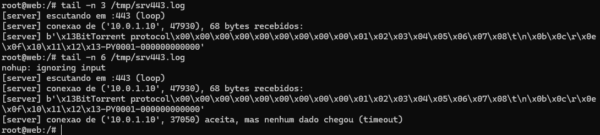

### 6.4 Teste: tráfego não-BitTorrent na mesma porta

```bash
python3 /shared/bt_peer.py client 10.0.2.10 443 --plain
```

Resultado: o servidor recebeu o texto enviado normalmente, confirmando que o L7 não bloqueia por porta, apenas quando a assinatura BitTorrent aparece no payload.

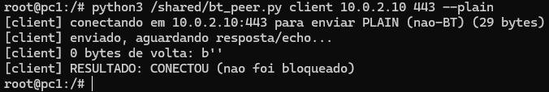
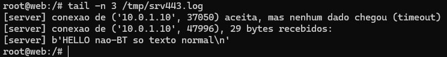

### 6.5 Teste: consulta DHT em porta fora do range do L4

```bash
python3 /shared/bt_peer.py dht 10.0.2.10 33445
```

A porta 33445/udp está fora da faixa bloqueada pelo L4 (6881–6999). Mesmo assim, a consulta foi bloqueada pelo L7, e o contador de pacotes da regra referente à assinatura DHT, na cadeia `L7`, foi incrementado.

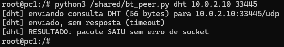
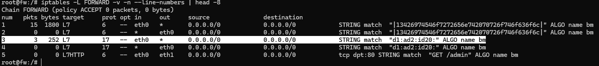

### 6.6 Teste: controle de recurso da aplicação (/public x /admin)

```bash
curl -s -o /dev/null -w 'GET /public/ -> %{http_code}\n' http://10.0.2.10/public/
curl -s -o /dev/null -w 'GET /admin/ -> %{http_code}\n' http://10.0.2.10/admin/
```

Resultado: `GET /public/` retornou 200 (permitido); `GET /admin/` teve a conexão recusada/resetada pela cadeia `L7HTTP`. Isso demonstra o controle de um recurso específico dentro da mesma aplicação Web, na mesma porta 80.

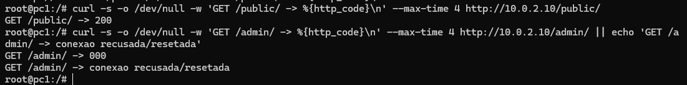

### 6.7 L4 + L7 juntos

Com as duas camadas ativas ao mesmo tempo, foi repetida a bateria de testes: o tráfego para `web:6881` caiu no L4 (timeout no connect); o tráfego para `web:443` passou pelo L4 mas foi barrado pelo L7 (conectou, mas sem dado); e o acesso a `/admin/` caiu na cadeia `L7HTTP`. Cada camada cobriu exatamente o que a outra não cobre.

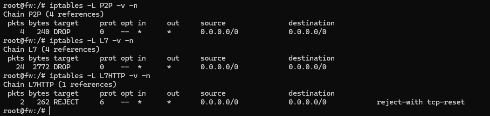

### 6.8 Análise do experimento L7 (DPI)

O DPI por assinatura resolveu a limitação evidenciada no L4: como examina o conteúdo do pacote e não a porta, identifica a aplicação independente de qual porta ela está usando, e ainda permite controlar um recurso específico dentro de uma aplicação Web (path `/admin`).

Limitações evidenciadas/esperadas: não enxerga tráfego realmente cifrado (se o BitTorrent estivesse dentro de um túnel TLS de verdade, a assinatura não apareceria no payload visível); a assinatura pode ficar fragmentada entre dois pacotes TCP, e o `-m string` do Linux examina pacote a pacote; qualquer protocolo que contenha por acaso a mesma sequência de bytes gera falso positivo; e o custo de CPU por pacote é maior que o do L4, por examinar o payload inteiro.

---

## 7. Filtragem de DNS — bloqueio de domínio e de categoria

### 7.1 Objetivo

Cobrir os dois itens do enunciado que o DPI por assinatura não resolve: bloquear um domínio específico e bloquear uma categoria inteira de sites, decidindo antes mesmo de qualquer pacote de dado sair da máquina.

### 7.2 Como funciona

Como o laboratório não tem acesso à internet real, foi utilizada uma lista de domínios fictícios para o teste. O script `dns/root/dns_filter.sh` sobe um servidor `dnsmasq` na máquina `dns` (10.0.2.11) com a seguinte configuração:

| Nome | Categoria | Resposta do DNS |
|---|---|---|
| loja.exemplo | (permitido) | 10.0.2.10 (resolve normal, para o web) |
| filmes-gratis.exemplo | domínio específico bloqueado | 0.0.0.0 |
| serie-online.exemplo | categoria "streaming pirata" | 0.0.0.0 |
| torrent-facil.exemplo | categoria "streaming pirata" | 0.0.0.0 |

Quando o nome consultado está na lista de bloqueio, o servidor responde 0.0.0.0. O nome nunca vira um endereço utilizável, então nenhuma conexão chega a ser aberta. É o controle mais barato possível, porque a decisão acontece antes de qualquer pacote de dado sair da máquina cliente.

### 7.3 Aplicação e testes

```bash
bash /root/dns_filter.sh
```

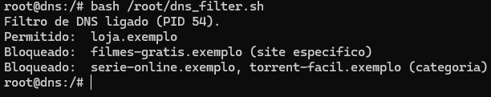

```bash
dig @10.0.2.11 loja.exemplo +short
dig @10.0.2.11 filmes-gratis.exemplo +short
dig @10.0.2.11 serie-online.exemplo +short
dig @10.0.2.11 torrent-facil.exemplo +short
```

| Consulta | Esperado | Observado |
|---|---|---|
| loja.exemplo | permitido, resolve | 10.0.2.10 |
| filmes-gratis.exemplo | bloqueado (domínio) | 0.0.0.0 |
| serie-online.exemplo | bloqueado (categoria) | 0.0.0.0 |
| torrent-facil.exemplo | bloqueado (categoria) | 0.0.0.0 |

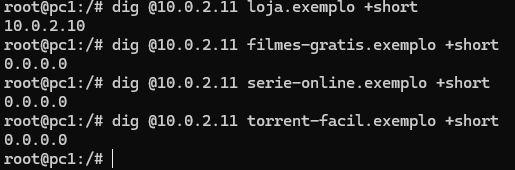

### 7.4 Log do servidor DNS

O log do próprio `dnsmasq` confirma as 4 consultas chegando e mostra a decisão tomada para cada nome. É o mesmo servidor e a mesma porta, respondendo de forma diferente conforme o nome pedido:

```bash
tail -n 12 /tmp/dnsmasq.log
```

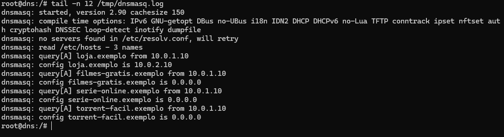

### 7.5 Análise da filtragem de DNS

A filtragem de DNS cobriu exatamente o que faltava no DPI: bloqueio por domínio específico e por categoria inteira de sites, com custo praticamente nulo, já que é só uma tabela de nomes.

O controle só funciona se o cliente realmente utilizar esse servidor DNS. Qualquer aplicação pode ignorar esse resolver e usar outro, público por exemplo, ou até acessar um endereço IP fixo sem nunca perguntar um nome. Também não enxerga conteúdo nem caminho de URL, por isso complementa o DPI do item 6 em vez de substituí-lo.

---

## 8. Conclusão

Os experimentos deste laboratório cobriram mecanismos de segurança em praticamente toda a pilha de comunicação. Na camada de enlace (L2), o endereço MAC identificou e isolou um dispositivo comprometido específico, o `pc2`, mas mostrou seu limite natural, porque esse endereço não sobrevive a uma travessia por roteador e só serve dentro do mesmo segmento de rede. Na camada de rede (L3), o protocolo ICMP e o endereço IP de destino permitiram políticas mais específicas, e o experimento com bloqueio por IP expôs uma limitação parecida, um domínio pode ter vários endereços e um endereço pode hospedar vários domínios, o que torna esse critério frágil quando o alvo real é um serviço, não um número IP isolado.

Na camada de transporte (L4), o bloqueio por porta se mostrou barato e eficaz contra o uso das portas oficiais, mas caiu na primeira tentativa de evasão simples, bastou trocar a porta do tráfego BitTorrent para 443 para o bloqueio deixar de funcionar (item 5.5). A camada de aplicação (L7), por DPI de assinatura, cobriu exatamente essa lacuna ao examinar o conteúdo do pacote em vez do número da porta (item 6.3), e ainda permitiu um controle mais fino, liberando `/public` e bloqueando `/admin` dentro da mesma aplicação Web. Por fim, a filtragem de DNS (item 7) resolveu o que nem o L4 nem o L7 cobriam: bloqueio por domínio e por categoria inteira de sites, decidido antes mesmo de o primeiro pacote de dado sair da máquina.

Ao longo de todo o laboratório, o firewall operou sob o princípio de Default Deny, bloqueando por padrão e liberando apenas o necessário, com a filtragem stateful permitindo diferenciar conexões novas de respostas a conexões já estabelecidas.

Nenhum mecanismo isolado se mostrou suficiente: o MAC tem alcance só local, o IP pode não representar de fato um domínio ou serviço, o L4 é evadido por troca de porta, o DPI não enxerga tráfego realmente cifrado, e a filtragem de DNS só vale se o cliente usar o resolver configurado. É exatamente essa cadeia de limitações, cada camada cobrindo o ponto cego da anterior, que sustenta a ideia de defesa em profundidade. Perímetro, L2, L3, L4, L7 e DNS Filtering juntos, e não isoladamente, formam a arquitetura de segurança completa deste laboratório.
